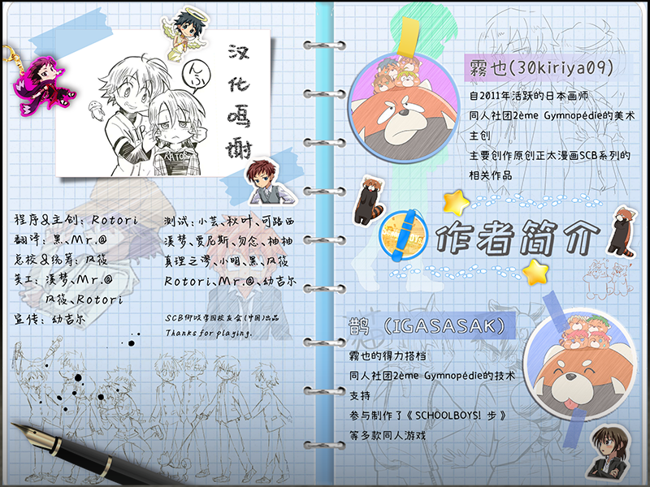

# SCHOOLBOYS! \~Yume no Misakisai Hen\~

This repository contains the source code for the Ren'Py port of SCHOOLBOYS! \~Yume no Misakisai Hen\~（SCHOOLBOYS!－夢の御咲祭編－）, adapted from the LiveMaker Chinese translation released by the SCB Misaki Academy Alumni Group.

Resources (images, audio, and movies) are excluded because they are covered by separate licenses.

## About This Project

The original game was created in LiveMaker by 2eme Gymnopedie:
- Archive link: https://web.archive.org/web/20240305134645/http://2emegymnopedie.blog77.fc2.com/

Based on the LiveMaker Chinese translation produced by the SCB Misaki Academy Alumni Group (QQ group), this project ports the game to the Ren'Py engine. Text proofreading and optimization were done by [JesseWhite](https://github.com/jessewhite68/).

- QQ group information can be found on the community website: https://schoolboys.azurewebsites.net/addon

The SCB community group is currently proofreading this release version.

## Original Japanese Version

The original LiveMaker Japanese version is available on Freem!:
- https://www.freem.ne.jp/dl/win/14436

## Credits

For information about the original Chinese translation contributors, please refer to the image below.

## Disclaimer

This repository is for preservation, porting, and technical adaptation purposes. Rights to original game content remain with their respective owners.
